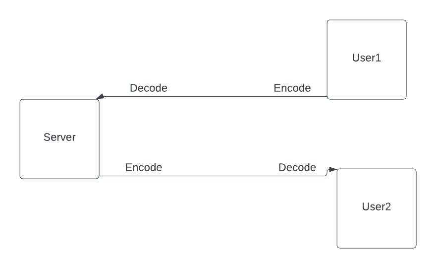

<h1>ChatRoom (Alan Sikarov, Keith Kwan, Dawin Ye) </h1>

<h2> Setup </h2>
Our code is split up into two parts, a server file and a client file.
Servers must be initialized first for a client to connect, so create 
a server by running <code><b>go run server.go {port number}</b></code>. To 
create a client, run <code><b>go run client.go {host address} {port number} {username}</b></code>. 
Negative port numbers and port numbers above 65536 are not allowed. For the purposes of this assignment, we have decided to limit the host address to 
127.0.0.1 so clients can only connect to servers on the same machine. 

<h2> Usage </h2>
After running the server in a terminal, the only command that the server can take is
<b>"EXIT"</b>, which will exit the server and close all clients and their connections. Other 
inputs into the server terminal will not be supported. 

To send a message from user1 to user2 go to user1's client and enter 

"<b>user2,, {message to deliver}</b>"

<h2> Documentation </h2>
We decided to use two commas as a separator between the username and content because two commas 
wouldn't normally be part of a message, whereas one comma or any other punctuation would be. Messages 
that are not formatted this way will generate errors, such as not having a separator or having multiple 
sets of separators.

Each server creates a map which will store usernames (keys) and the respective connection (value).
Using a map is efficient because as the server receives a message from user1, it can check if user2
has made a connection with the server, and if it has, then it can send a message to user2. It is also useful 
for when the server wants to exit, as the program will iterate through the map and tell users to exit
as well as close their connections. Finally, the stopServer() function runs a continuous for loop to check if
the exit command is entered.

For serialization, we decided to use gob as that was what our HW1 Q3 told us that it was the fastest out of the methods
that we tested. The flow of information with encoding and decoding can be seen in the following figure. In instances where
a function would need to encode/decode multiple times, we tried to reuse the encoder/decoder objects if it didn't generate errors.
In the first set of encoding and decoding, the sending client and server encode/decode the message as a message struct. However,
in the second encoding/decoding it is done as a string. This is because neither client needs to know all three parts of the message
struct (sender needs to know it was delivered to recipient, recipient needs to know who send it plus the content). To do this
the message struct had three values, To, From and Content which were all strings. 
 

All communication written and read between the server and clients are stored in byte arrays of size 500.
This means that there will be errors or cut off text if messages are longer than 500 characters. We decided to use 500
as significantly longer messages were not needed, and it is impossible to dynamically allocate an array of the specific
size as the message being read in (don't know how big the message is before we call conn.Read(arr), so 500 is sufficiently large enough.
Finally, in regard to printing messages, our client uses <code>sliceHelper(msg[4:]) </code>. This is because we found that the first 4 
bytes of a decoded byte array from gob are unnecessary, as well as the last bytes starting with the number 10 (new line char). These quirks in the byte array
made us decide to process it so that the message would print nicer without the new line. It should be noticed that this will take O(log(n)) time, but we decided it was 
worth the trade-off to have more streamlined messages. The recipient is the only one that needs to check for the new line character, which is seen sliceHelper().

For future implementations, it would be possible for us to have different sized byte arrays created say 1,000, 10,000, and 1,000,000 and basically have copies of the different functions with only their array size being different. This would allow cases where someone may want to send a 1,000 character message or even 10,000. However we decided it was not necessary to do this for the homework but could be part of a larger implementation.

<h2> Sources </h2>
I used this example code to re-familiarize myself with maps and slices: https://gobyexample.com/maps
https://gobyexample.com/slices

I used this example to catch EOF errors from repeatedly printing in for loops
http://www.inanzzz.com/index.php/post/j3n1/creating-a-concurrent-tcp-client-and-server-example-with-golang

This link was helpful in sending structs through a connection using gob
https://dchua.com/posts/2017-06-23-sending-your-structs-across-the-wire/

